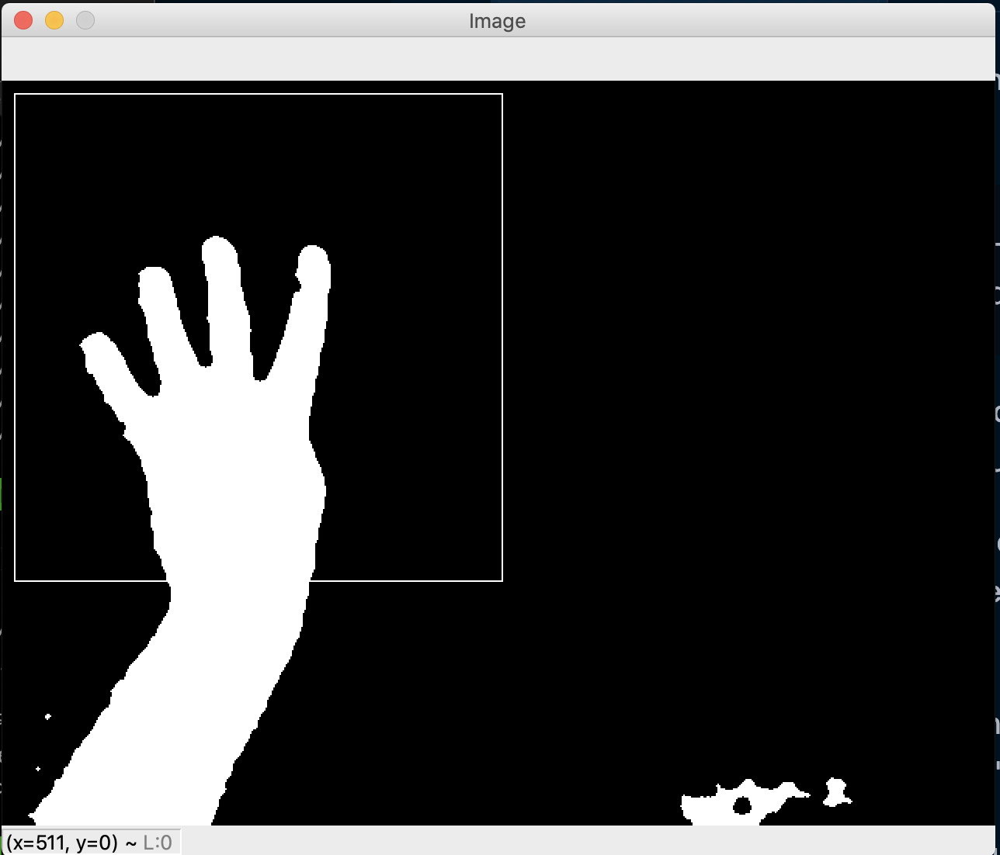

# CNN:Detect hand gestures/symbols

This repo contains code that can perform the following tasks

1. Capture images for training & testing
2. Create training and validation generators
3. Train model
4. Predict on a specific image
5. Predict on live stream from webcam

## Capture images

To capture images for training use the following command

    python capture.py --grayscale --name thumbsup --mode training

- Above command will open a window with video stream from your webcam.

- There is a rectangle box on the top left corner, this will be the area captured and saved to disk.

- Click "s" to capture the current frame and save to disk , click "q" to exit.

- images will be saved under data/{training|test}/{name}/{name}-1.jpg

## Data Generators

This project uses keras ImageDataGenerator to agument images and creates generators for both training and testing. 

Run the following command to get information about the data

    python images_gen.py

## Training model

The model is defined in **model.py** and the training happens in **main.py** , once you create your training dataset use the following command to train the model.

    python main.py

Once the model is trained, the weights will be saved into hand_symbols.h5, the repo already has a file with the same name which are weights for model that has been trained to recognize two, four, thumbsup, thumbsdown and stop.

## Predicton on a specific image

Once the model is trained , the trained weights will be saved in hand_symbols.h5. Use the following command to predict using a specific image

    python predict.py --image <path_to_image>

## Predict live using webcam

Run the following command to show live predictions using webcam.

    python predict_live.py

